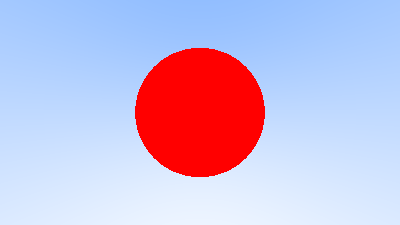

# Ray Tracing in One Weekend (Rust Implementation)



本リポジトリは、コンピュータグラフィックスの古典的なガイドブックである *Ray Tracing in One Weekend* を **Rust** で実装したものです。

## Features

現在はプロジェクトの初期段階であり、数学的な基礎部分の実装を中心に行っています。

* **Math Library (`Vec3`)**:
  * 基本的な算術演算、内積・外積、正規化をサポートするカスタムベクタ構造体を実装しました。
  * Rustの所有権やトレイトシステムを意識した設計になっています。
* **Ray Generation**:
  * カメラのビューポート計算とレイ（光線）の生成ロジックを実装しました。
  * 画像座標系から仮想世界座標系へのマッピングを行っています。
* **Shading & Rendering**:
  * レイの方向に基づいた線形補間（Lerp）による、青から白への背景グラデーション描画を実装しました。
* **Output**:
  * `image` クレートを使用して `image.png` を生成します。
  * レンダリングの進捗状況を確認できるターミナル用プログレスバーを含んでいます。

## Motivation

ブラックボックスになりがちなレンダリングの仕組みを、低レイヤー（Rust）から実装することで深く理解するために作成しました。テクニカルアーティスト（TA）として、以下のスキル習得を目指しています。

* **Deep Understanding of Graphics**:
  * ゲームエンジンに頼らず、レイやベクトル演算を物理的に実装することで、シェーディングやカメラ投影といった概念を明確にします。
* **Memory Safety & Performance**:
  * ガベージコレクションのない環境でのメモリ管理を学ぶため、高速なグラフィックスプログラミングに不可欠なRustを選択しました。

## Usage

Rustがインストールされている環境で、以下のコマンドを実行してください。

```bash
cargo run --release
```

リリースモードでビルド・実行を行い（レイの計算は負荷が高いため）、プロジェクトルートに `image.png` を生成します。
